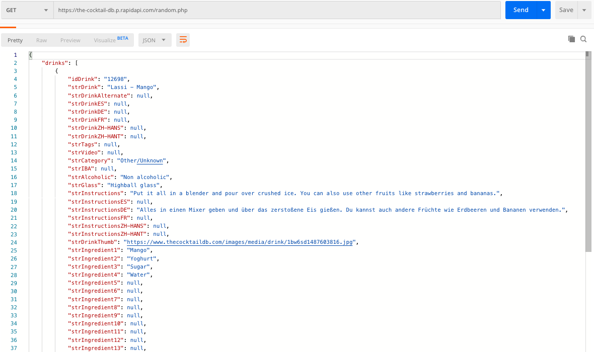
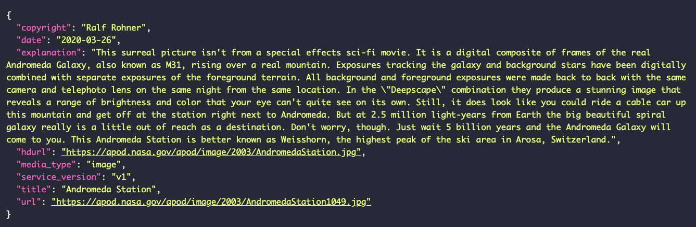
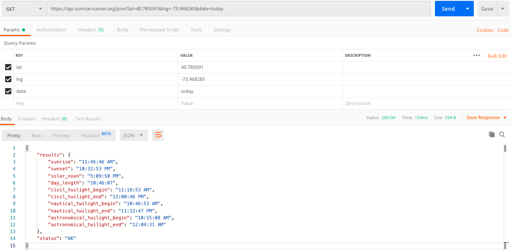
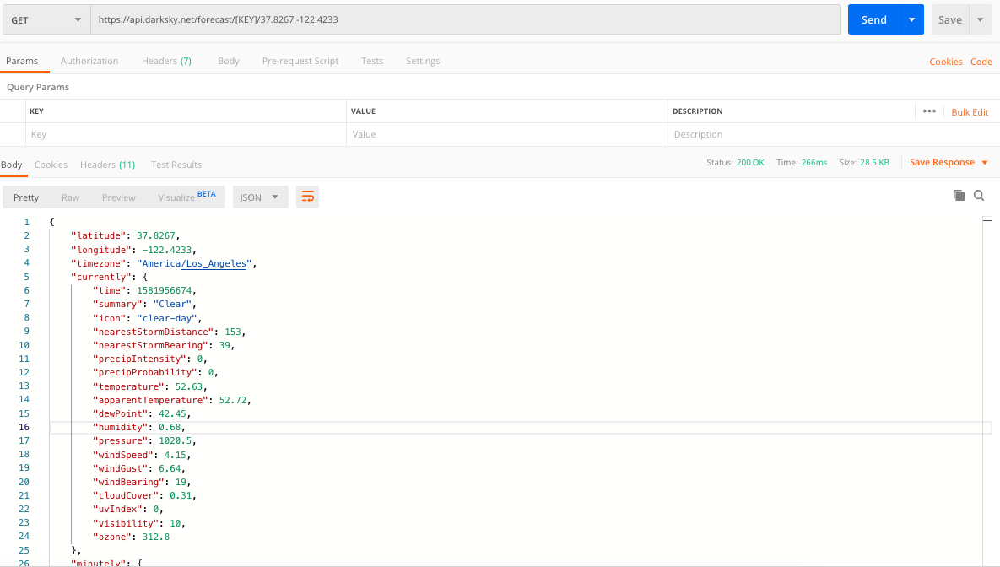
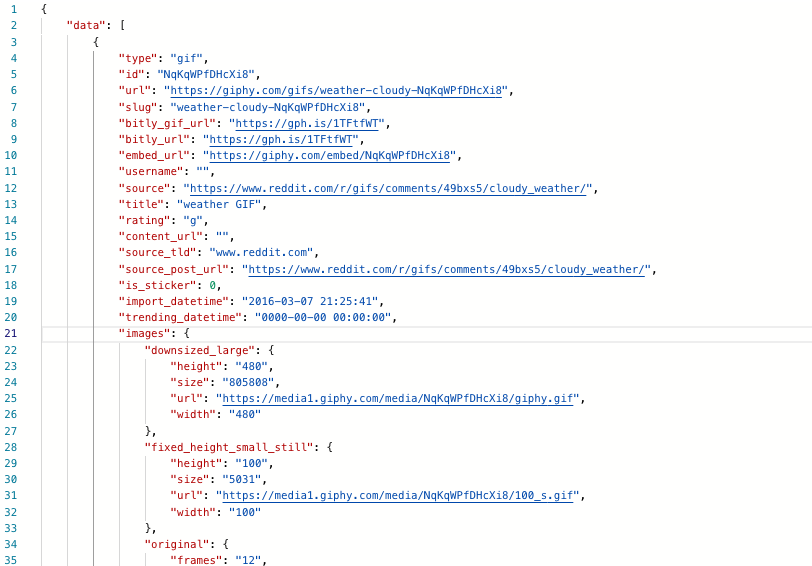

# Practice BackEnd
### My backend created with Flask to make API Calls to my front-end. 

## Week 1

### TODO:
1. Learn Python Syntax on Codecademy [In Progress]
2. Install Python on Computer [Completed]
3. Be able to run code successfully on VSCode [Completed]

## Week 2

### TODO:
1. Read Flask Documentation
2. Watch videos on Flask
 - To get a better understanding of how to impliment
3. Import Flask
4. Testing different fucntions on VS code
5. Watching Videos on Flask
    - https://www.youtube.com/watch?v=PTZiDnuC86g&feature=youtu.be
    - https://www.youtube.com/watch?v=w25ea_I89iM&feature=youtu.be
6. Harverd Class Course
    - https://online-learning.harvard.edu/course/cs50s-web-programming-python-and-javascript?delta=0

## Week 3

### TODO:
1. Continued learning with the different videos
    - Testing on Repl.it 
2. Test Route created and working
    - Test with front end needed
    - Test API to ensure data comes in
3. Move API's from front end to back end
4. Deploy to Heroku

## API's to Use

### Random Cocktail Generator
https://the-cocktail-db.p.rapidapi.com/random.php

### Nasa Picture of the Day [UPDATED]
https://api.nasa.gov/planetary/apod?api_key=DEMO_KEY

### Sunrise and Sunset
https://api.sunrise-sunset.org/json?lat=40.785091&lng=-73.968285&date=today

### Weather API
https://api.darksky.net/forecast/[KEY]/[LAT],[LON]

### Giphy API
api.giphy.com/v1/gifs/search

<!-- need to add sample -->